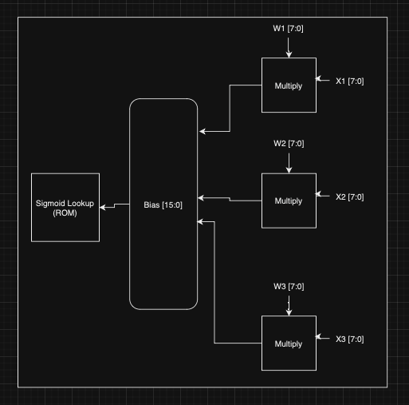

# FPGA-Based Neural Network for Color Detection

This project implements a simple neural network in Verilog to run on an FPGA for the purpose of color detection. The system reads RGB values from input files, processes them, and outputs the detected color gradients. To gain understanding, hardware modules for Neuron, Neural Network, Sigmoid IP (Using Read-Only Memory), and Control Signal Timing were created.

## Project Overview

The input image and the processed output image are displayed and compared to illustrate the color detection capabilities of the neural network. These weights are initialized so it could detect blue values. 

## Original and Processed Output Images

The original image is read from `bird_rgb_values.txt` and visualized below:

  
  

## Hardware Modules

To gain understanding, hardware modules for Neuron, Neural Network, Sigmoid IP (Using Read-Only Memory), and Control Signal Timing were created.

